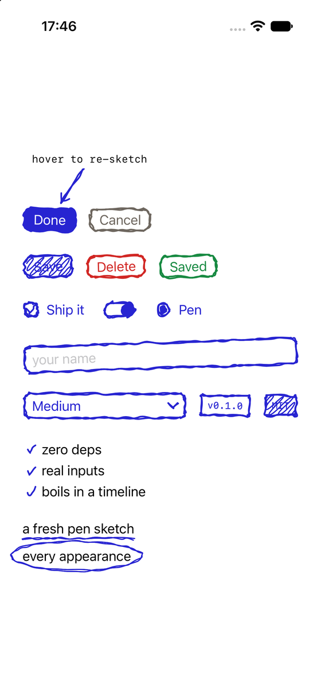
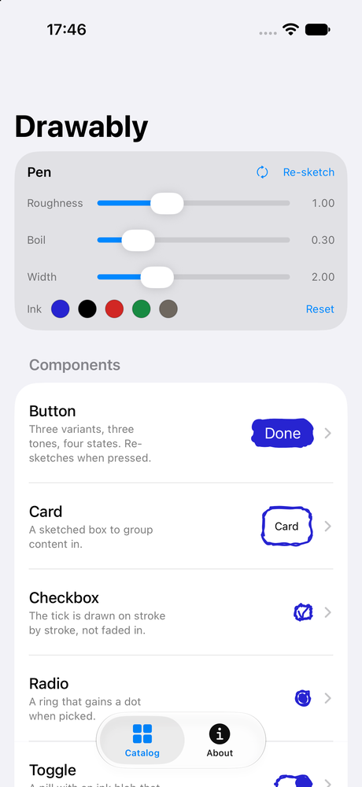
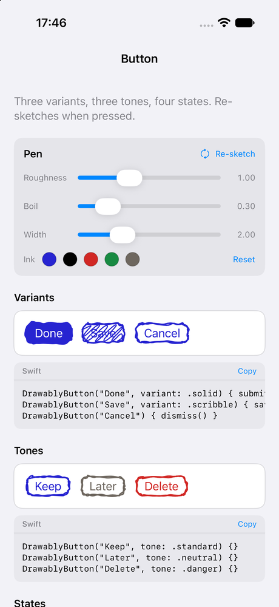
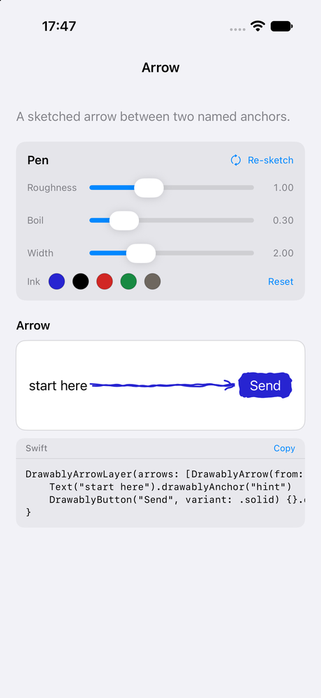

<div align="center">

# Drawably for SwiftUI

**Hand-drawn UI controls that sketch themselves fresh on every appearance,
boil gently while idle, and re-sketch when you touch them.**

[](https://github.com/dim971/drawably-ios/actions/workflows/ci.yml)
[](https://swift.org)
[](#requirements)
[](#installation)
[](LICENSE)



</div>

A SwiftUI port of [**Drawably**](https://www.drawably.dev) by Daniel Belyi
([source](https://github.com/Danilaa1/drawably), MIT). The stroke engine is a
direct port of the original's, checked against fixtures generated from the
published npm package — see [Fidelity](#fidelity).

```swift
DrawablyButton("Done", variant: .solid) { submit() }
```

## Contents

- [Requirements](#requirements)
- [Installation](#installation)
- [Quick start](#quick-start)
- [Components](#components)
- [Theming](#theming)
- [Motion and accessibility](#motion-and-accessibility)
- [Fidelity](#fidelity)
- [Showcase app](#showcase-app)
- [Documentation](#documentation)
- [Contributing](#contributing)
- [Licence](#licence)

## Requirements

iOS 17+ or macOS 14+, Swift 6, Xcode 16+. No dependencies.

## Installation

Swift Package Manager:

```swift
dependencies: [
    .package(url: "https://github.com/dim971/drawably-ios", from: "0.1.0"),
]
```

Or in Xcode: **File ▸ Add Package Dependencies…** and paste the URL.

```swift
import Drawably
```

## Quick start

```swift
import Drawably
import SwiftUI

struct ContentView: View {
    @State private var agreed = false
    @State private var name = ""

    var body: some View {
        VStack(alignment: .leading, spacing: 16) {
            DrawablyTextField("your name", text: $name)
            DrawablyCheckbox("Ship it", isOn: $agreed)
            DrawablyButton("Done", variant: .solid) { submit() }
        }
        .drawablyTheme { theme in
            theme.stroke = .black
            theme.fill = .black
        }
    }
}
```

## Components

All fifteen upstream controls, with upstream's defaults.

| Component | What it is |
| --- | --- |
| `DrawablyButton` | Three variants (`.outline`, `.solid`, `.scribble`), three tones (`.standard`, `.neutral`, `.danger`), four states (`.idle`, `.loading`, `.error`, `.success`). Re-sketches on press and hover, and washes its inside with its own ink — 18% pressed, 10% hovered. |
| `DrawablyCard` | A sketched box to group content in. |
| `DrawablyCheckbox` | The tick is drawn on stroke by stroke over 240ms. |
| `DrawablyRadio` | A ring that gains a dot when picked. |
| `DrawablyToggle` | A pill with an ink blob that slides across it. |
| `DrawablyTextField` | One line of text in a sketched box. |
| `DrawablyTextEditor` | Several lines of it. |
| `DrawablyPicker` | A pen chevron opening a sketched list, tailed back to the field — no platform chrome around it. Pre-sized to the widest option so picking never shifts the layout. |
| `DrawablyDivider` | A pen line across the available width. |
| `DrawablyBadge` | A small sharp-cornered tag. `.outline` or `.scribble`. |
| `DrawablyList` | Bullets drawn in the gutter. `.dash` or `.check`. |
| `.drawablyUnderline()` / `.drawablyHighlight()` / `.drawablyCircle()` | Marks over any view; on `Text` they land once per line the run wraps onto. |
| `DrawablyArrowLayer` + `.drawablyAnchor(_:)` | A sketched arrow between two named anchors. |
| `.drawablyTilt()` | Leans a control a couple of degrees, so a group looks laid out by hand. Seeded, so it is stable — and the same seed leans the same way on Android. |

`DrawablyCheckboxStyle` and `DrawablyToggleStyle` are `ToggleStyle`s and
`DrawablyButtonStyle` is a `ButtonStyle`, so any existing `Toggle` or `Button`
can wear the sketch.

Full reference: [docs/components.md](docs/components.md).

## Theming

`DrawablyTheme` mirrors upstream's CSS custom properties, defaults included, and
travels through the environment the way they cascade.

| Property | Default | What it does |
| --- | --- | --- |
| `stroke` | `#2724d1` | Line colour |
| `fill` | `#2724d1` | Filled layers: a solid button's blob, a radio's dot, a highlight's wash |
| `paper` | white | What the ink sits on; a solid button's label is drawn in it |
| `width` | `2` | Stroke width for ordinary layers |
| `error` / `success` | `#d12724` / `#188a42` | Semantic ink |
| `roughness` | `1` | Jitter amplitude of the base sketch |
| `boil` | `0.3` | Per-frame flicker amplitude; `0` renders a still sketch |

More in [docs/theming.md](docs/theming.md).

## Motion and accessibility

Upstream boils by stepping a CSS custom property through three pre-rendered
frames every 1200ms, and speeds that up to 450ms while a button is loading. The
same happens here on a `TimelineView`: three frames are generated once per box
size, seed and options, and the draw pass only picks which one to stroke.

`accessibilityReduceMotion` stops the boil and the re-sketch entirely, the same
way `prefers-reduced-motion` does upstream.

Every control wraps a real SwiftUI control, so VoiceOver, focus and keyboard
behave as they would without the sketch — it is drawn behind and carries no
semantics.

## Fidelity

Every shape is generated by a direct port of upstream's `prng.ts` and
`rough.ts`. The tests replay fixtures produced by the published npm package and
assert the ported engine emits **byte-identical** path data — the same PRNG
stream, the same sample counts, the same boil frames, for all 26 control layers.

The details, including the JavaScript/Swift reconciliations it needed, are in
[docs/fidelity.md](docs/fidelity.md).

## Showcase app

A catalog app listing every component with a live preview, a screen per
component showing its variants with copyable code, and pen controls on every
screen so you can feel roughness, boil, width and ink.

<p align="center">
  
  
  
</p>

```sh
make showcase      # generate, build and run it in the simulator
```

## Documentation

| Document | What it covers |
| --- | --- |
| [Getting started](docs/getting-started.md) | Installing, the first control, common patterns |
| [Components](docs/components.md) | Every component, its parameters and its behaviour |
| [Theming](docs/theming.md) | The theme, seeds, and drawing your own shapes |
| [Fidelity](docs/fidelity.md) | How the port is verified against the original |
| [Architecture](docs/architecture.md) | How a sketch gets from the engine to the screen |
| [Coding style](docs/coding-style.md) | The API design guidelines as they apply here, and where we differ |

## Contributing

Issues and pull requests are welcome — see [CONTRIBUTING.md](CONTRIBUTING.md)
for how to build, test and what the review looks for. Everyone taking part is
expected to follow the [Code of Conduct](CODE_OF_CONDUCT.md).

## Licence

MIT — see [LICENSE](LICENSE).

Upstream Drawably is © 2026 Daniel Belyi, also MIT. This port carries its own
[NOTICE](NOTICE) crediting it.
