# Components

Every control takes an optional `seed:`; see [theming.md](theming.md#seeds).

## Button

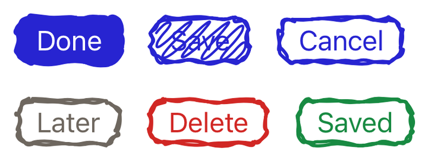

```swift
DrawablyButton("Done", variant: .solid, tone: .standard, state: .idle) { submit() }
DrawablyButton(variant: .outline) { submit() } label: { Label("Send", systemImage: "paperplane") }
```

| Parameter | Values | Default |
| --- | --- | --- |
| `variant` | `.outline`, `.solid`, `.scribble` | `.outline` |
| `tone` | `.standard`, `.neutral`, `.danger` | `.standard` |
| `state` | `.idle`, `.loading`, `.error`, `.success` | `.idle` |

- `solid` fills the box with an ink blob and draws the label in `paper`.
- `scribble` hatches it at a fixed 45°.
- `neutral` is a warm grey, `danger` the theme's `error`.
- A state recolours the ink without touching the theme. `loading` also dims the
  button, disables it, and boils at 450ms instead of 1200ms.
- Pressing lifts the outline to 1.4× its width, sinks the button, and washes its
  inside with 18% ink; hovering washes at 10%. A solid button is skipped — it is
  already filled.

Also available as `DrawablyButtonStyle` for any `Button`.

## Card

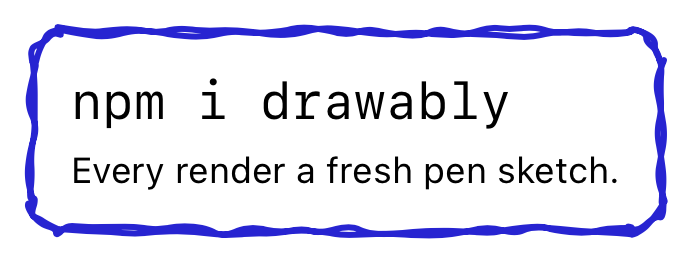

```swift
DrawablyCard { Text("npm i drawably") }
```

A sketched box with 16pt of padding.

## Checkbox

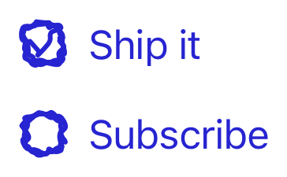

```swift
DrawablyCheckbox("Ship it", isOn: $agreed)
DrawablyCheckbox(isOn: $agreed)              // the box on its own
```

22pt square. The tick is *drawn on* over 240ms rather than faded in — upstream
animates `stroke-dashoffset`, this trims the path. Also available as
`DrawablyCheckboxStyle` for any `Toggle`.

## Radio

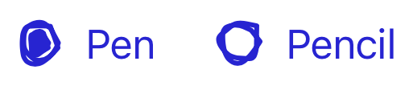

```swift
DrawablyRadio("Pen", selection: $tool, value: "Pen")
```

22pt square. The dot pops in from half size. Selection is by value, so a group
is several `DrawablyRadio`s sharing one binding.

## Toggle

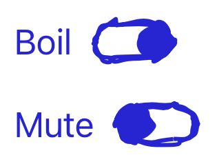

```swift
DrawablyToggle("Boil", isOn: $boiling)
```

44×24pt. The knob slides the pill's width less its height, so it lands centred
at either end. Also available as `DrawablyToggleStyle`.

## Text field and text editor

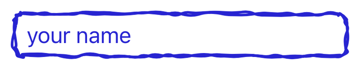
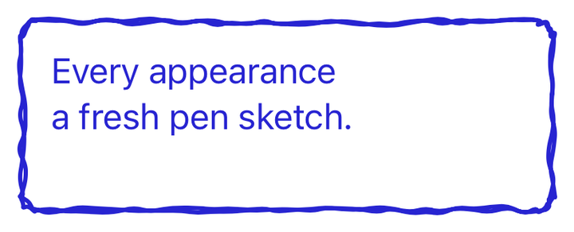

```swift
DrawablyTextField("your name", text: $name)
DrawablyTextEditor(text: $notes, minHeight: 96)
```

Real `TextField` and `TextEditor` inside the shared sketched box, with the focus
ring shown on focus. Neither re-sketches on hover, matching upstream.

## Picker

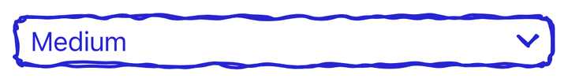
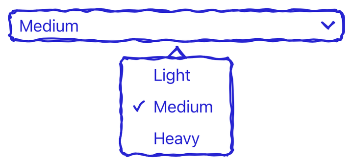

```swift
DrawablyPicker(selection: $weight, options: ["Light", "Medium", "Heavy"]) { $0 }
```

A sketched box with a pen chevron. The box is laid out over every option at zero
opacity, so it is already as wide as the widest one and picking never shifts the
layout around it.

Opening it shows a sketched list centred underneath, with a pen tail pointing
back at the field and a tick beside the chosen option. There is no platform
popover around it: the list is anchored directly, so the tail always points at
something. A tap anywhere else closes it.

## Divider

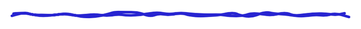

```swift
DrawablyDivider()
```

A pen line across the available width, in a 10pt-tall box.

## Badge

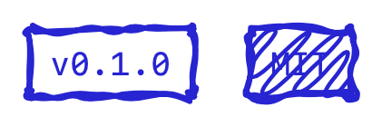

```swift
DrawablyBadge("v0.1.0")
DrawablyBadge("MIT", variant: .scribble)
```

A tight sharp-cornered tag in monospace. Its padding is derived from the theme,
not fixed, so the label stays clear of the outline however thick or rough the
pen gets.

## List

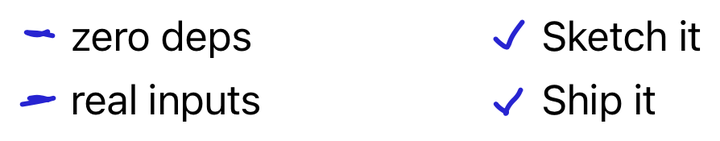

```swift
DrawablyList(steps, id: \.self, marker: .check) { step in
    Text(step)
}
```

`marker` is `.dash` or `.check`. Markers are drawn in the 24pt leading gutter,
each row seeded by its index. For `Identifiable` data the `id:` argument can be
left out.

## Text decorations

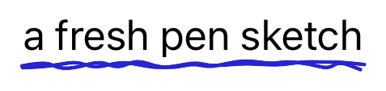
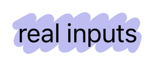
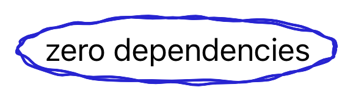

```swift
Text("a fresh pen sketch").drawablyUnderline()
Text("real inputs").drawablyHighlight()
Text("zero dependencies").drawablyCircle()
```

On `Text` these mark every line the run wraps onto, using `TextRenderer`
(iOS 18+); below that, and on any other view, the whole thing is marked as one
box. Underline and circle re-sketch on hover; highlight does not. They draw at
1.5pt rather than the control default of 2 — body copy is thinner than chrome.

## Arrow

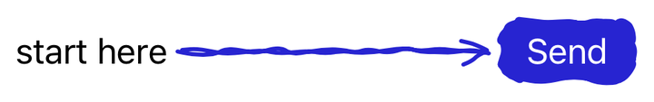

```swift
DrawablyArrowLayer(arrows: [DrawablyArrow(from: "hint", to: "send")]) {
    Text("start here").drawablyAnchor("hint")
    DrawablyButton("Send", variant: .solid) {}.drawablyAnchor("send")
}
```

Anchors resolve against the layer, so they do not drift when the content
scrolls. The arrow runs centre to centre, pulled back to each box's edge plus a
little clearance.

## Tilt

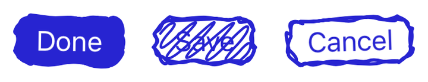

```swift
DrawablyButton("Done", variant: .solid) {}.drawablyTilt()
DrawablyCard { … }.drawablyTilt(degrees: -1.5)
```

A small lean, so a group of controls looks laid out by hand. The seeded angle
comes from the same PRNG the sketches do, so a given seed leans the same way
here as on Android. It is picked once and held: a control that shifted every
time it re-sketched would be unusable. Like CSS `transform: rotate`, it does not
affect layout.
